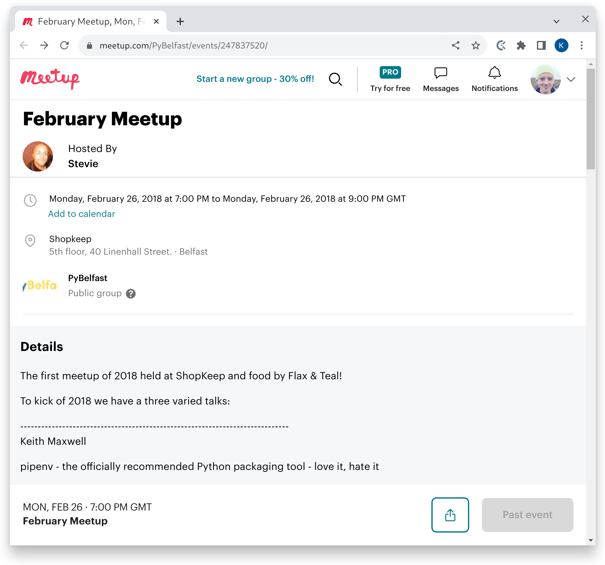
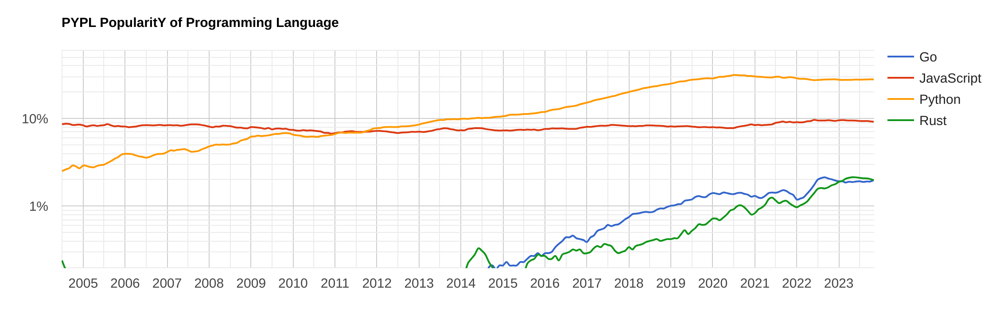

<!-- vim: set filetype=markdown.embedme.htmlCommentNoSpell.gfm : -->
<!--
SPDX-License-Identifier: CC-BY-NC-SA-4.0
SPDX-FileCopyrightText: 2023 Keith Maxwell
-->


<!-- https://www.canva.com/colors/color-palettes/healthy-leaves/ -->
<style>
:root {
    --custom-one: #3D550C;
    --custom-two: #81B622;
    --custom-three: #ECF87F;
    --custom-four: #59981A;
    --h1-color: var(--custom-one);
    /* --color-fg-default: black; */
}
</style>

# Single file scripts with dependencies

## No packaging

PyBelfast 2023-11-29

---

<!-- _backgroundColor: var(--custom-one) -->
<!-- _color: white -->

# Why the “no packaging” subtitle?

---

# February 2018

<!-- prettier-ignore-start -->

<div>

* South Korea was hosting the Winter Olympics in PyeongChang
* Python 3.6 was the latest available
* I was “here” talking about Python packaging

</div>

<!-- prettier-ignore-end -->

---

<style scoped>
img { height: 25em; }
</style>



---

<style scoped>
div.columns {
    margin-top: 2em;
    height: 15em;
    display: grid;
    grid-template-columns: 1fr 1fr;
    place-items: start end;
}
div.columns div:nth-child(2) {
      align-self: end;
}
</style>

_Also a 2021 Python Ireland [talk about packaging]_

<div class=columns>

<div>

- Now five years later
- …its easier, not easy
- A lot of new standards and tools

[talk about packaging]: https://www.youtube.com/watch?v=b4dzlUx-MuI

</div>

<div data-marpit-fragment>

_Python gives you choices_

_Enabled by standards_

_Standards evolve through Python Enhancement Proposals (PEPs)_

</div>

</div>

<!--

More in a second

Its rare to have two competing PEPs

-->

---

<style scoped>
div.columns {
    display: grid;
    grid-template-columns: 1fr 1fr;
    place-items: center start;
}
</style>

<div class=columns>

<div>

> There should be one-- and preferably only one --obvious way to do it.

-- `python -c "import this"`

_No; perhaps [humour]?_

[humour]: https://www.wefearchange.org/2010/06/import-this-and-zen-of-python.html

</div>

<div data-marpit-fragment>

- `venv` and `pip`
- `flit` or `setuptools`
- `nox` and `pipx`
- Ansible
- `pip-tools`
- _Linux containers_

</div>

</div>

<!--

Workflow tools like poetry or hatch

Packaging tools

Have people come across `npm exec`?

Was reading about pip-tools yesterday and was reminded of resoutions in yarn
https://yarnpkg.com/configuration/manifest#resolutions

-->

---

# Context

<style scoped>
img { width: 100%; }
.attribution {
    font-size: 0.8em;
    margin-left: auto;
    margin-right: 0;
}
</style>



<div class=attribution>

— “how often language tutorials are searched on Google” [PYPL](https://pypl.github.io/PYPL.html)

</div>

Other languages have options for "single static binary" or "single executable application" or "single-file deployments" whatever label you prefer

---

<!-- _backgroundColor: var(--custom-one) -->
<!-- _color: white -->

# Use cases

---

# Use case 0

Extract `1.1.337` from YAML like the following,

<!-- embedme example_0.yaml -->

```yaml
repos:
  - repo: https://github.com/psf/black
    rev: 23.11.0
    hooks: [{ id: black, language_version: python3.11 }]
  - repo: https://github.com/pycqa/flake8
    rev: 6.1.0
    hooks: [{ id: flake8 }]
  - repo: https://github.com/RobertCraigie/pyright-python
    rev: v1.1.337
    hooks:
      - id: pyright
        args: [--pythonpath=.venv/bin/python]
        files: ^$
        always_run: true
```

Yes I have used [`yq`](https://github.com/mikefarah/yq), imagine something difficult.

---

# Solution 0

<style scoped>
</style>

<!-- embedme example_0.py -->

```
from argparse import ArgumentParser
from pathlib import Path

from yaml import safe_load

REPO = "https://github.com/RobertCraigie/pyright-python"


if __name__ == "__main__":
    parser = ArgumentParser()
    parser.add_argument("file", type=Path)
    with parser.parse_args().file.open() as file:
        configuration = safe_load(file)
    rev = next(i["rev"] for i in configuration["repos"] if i["repo"] == REPO)
    print(rev.removeprefix("v"))

```

Command to run solution:

    .venv/bin/python example_0.py example_0.yaml

---

# Use case 1

```
 _________________
< Hello PyBelfast >
 -----------------
        \   ^__^
         \  (oo)\_______
            (__)\       )\/\
                ||----w |
                ||     ||

```

---

<!-- _backgroundColor: var(--custom-three) -->
<!-- _color: black -->

# A straw man solution

<!-- embedme example_1.ts -->

```typescript
import * as cowsay from "npm:cowsay";

const output: string = cowsay.say({ text: "Hello PyBelfast" });

console.log(output);
```

Command to run above:

    deno run --allow-read example_1.ts

---

> Imports are URLs or file system paths

— https://docs.deno.com/runtime/manual/basics/modules

<hr />

Deno also has a formatter, like Black, and a compiler for self-contained executables built in. It is a different set of batteries included. Interesting topic — PEP 594.

<!--

deno run https://examples.deno.land/hello-world.ts

-->

---

# Libraries

_This code exercises a [library]._

[library]: https://github.com/VaasuDevanS/cowsay-python/

<!-- TODO -->

https://github.com/PyAr/fades

<!--

Choosing libraries can be controversial. I wanted one that is maintained and works offline. I hope that we can all agree that this one is brilliant.

-->

---

# `pip-run`

<!-- embedme example_1_variable.py -->

```
__requires__ = ["cowsay"]
from cowsay import char_funcs


if __name__ == "__main__":
    char_funcs["cow"]("Hello PyBelfast!")

```

<!--
pipx install pip-run
-->

Command to run solution:

    pip-run example_1_variable.py

---

# `pip-run` similar to PEP 722

<!-- embedme example_1_requirements.py -->

```
# Requirements:
#   cowsay
from cowsay import char_funcs


if __name__ == "__main__":
    char_funcs["cow"]("Hello PyBelfast!")

```

Command to run solution:

    pip-run example_1_requirements.py

---

# Fades

<!-- embedme example_1_fades.py -->

```
from cowsay import char_funcs  # fades


if __name__ == "__main__":
    char_funcs["cow"]("Hello PyBelfast!")

```

<!--
lxc launch ubuntu:22.04 c1
lxc exec c1 -- apt update
lxc exec c1 -- apt install fades
lxc file push example_1_fades.py c1/root/
-->

Command to run solution:

    lxc exec c1 -- fades example_1_fades.py

---

<!-- _backgroundColor: var(--custom-one) -->
<!-- _color: white -->

_Stepping into a possible future…_

# Provisionally accepted standard format

---

# The PEP process

<div data-marpit-fragment>

[PEP 722] on discourse:

> There are 329 replies with an estimated read time of 164 minutes.

</div>

<div data-marpit-fragment>

<hr />

</div>

<div data-marpit-fragment>

> PEP 722 – Dependency specification for single-file scripts

> PEP 723 – Inline script metadata

</div>

<!-- prettier-ignore -->
* PEP 722 was rejected on 21 October 2023
* PEP 723 was provisionally accepted
* It is waiting for another PEP to change the `pyproject.toml` specification

---

<!-- _backgroundColor: red -->
<!-- _color: white -->

Warning: Everything else that I say is provisional on a new PEP which adds `requires-python` to the `run` table in the specification of `pyproject.toml`. Adopt this provisional specification at your own risk.

<div data-marpit-fragment>

The code I'll use is in a [pull request] on GitHub. It isn't in a release it may never be released. There is an [alternative implementation] at version 0.1.1.

</div>

[pull request]: https://github.com/pypa/pipx/pull/1100
[PEP 722]: https://peps.python.org/pep-0722/
[alternative implementation]: https://github.com/ThatXliner/idae

---

# Solution 1: provisionally accepted syntax

<!-- embedme example_1.py -->

```python
#!/usr/bin/env -S pipx run
from cowsay import char_funcs


if __name__ == "__main__":
    char_funcs["cow"]("Hello PyBelfast!")
# /// pyproject
# run.requirements = ["cowsay"]
# ///

```

Command to run the above:

    pipx run example_1.py

<!-- Even the simpler

    ./example_1.py

-->

---

## Bootstrapping

Use a released version of `pipx` to install this work-in-progress version:

    pipx install git+https://github.com/henryiii/pipx@henryiii/feat/pep723

Choose to ignore a warning, this is unreleased:

    ⚠️  Note: pipx was already on your PATH at /usr/bin/pipx

Pipx can also use the same branch without installing — omitted for brevity.

<!--

    pipx run --spec=git+https://github.com/henryiii/pipx@henryiii/feat/pep723 \
        pipx run example_1.py

Then choose to ignore this warning:

    ⚠️  pipx is already on your PATH and installed at /usr/bin/pipx. Downloading and running anyway.

-->

---

# Bonus: `pipx` can run URLs

Run a local server:

    python3.11 -m http.server

<!-- From a separate terminal check that `hi.py` is available

    curl http://127.0.0.1:8000/example_1.py

-->

Command to run the example from the network:

    pipx run http://127.0.0.1:8000/example_1.py

---

# About me

- Experienced Python developer and team lead
- Sometime "DevOps practitioner"
- Please let me know about opportunities

<div data-marpit-fragment>

<hr />

Python Ireland; PyCon Ireland earlier this month was brilliant and only three of us travelled South.

</div>

<div data-marpit-fragment>

<hr />

Artemis Technologies

- Same company, different sub-team
- [Junior Software Engineer](https://artemistechnologies.bamboohr.com/careers/83)
- [Senior Software Engineer](https://artemistechnologies.bamboohr.com/careers/82)

</div>

<!--
    pipx run cowsay -t 'Questions?'
-->

---

```
  __________
| Questions? |
  ==========
          \
           \
             ^__^
             (oo)\_______
             (__)\       )\/\
                 ||----w |
                 ||     ||
```
